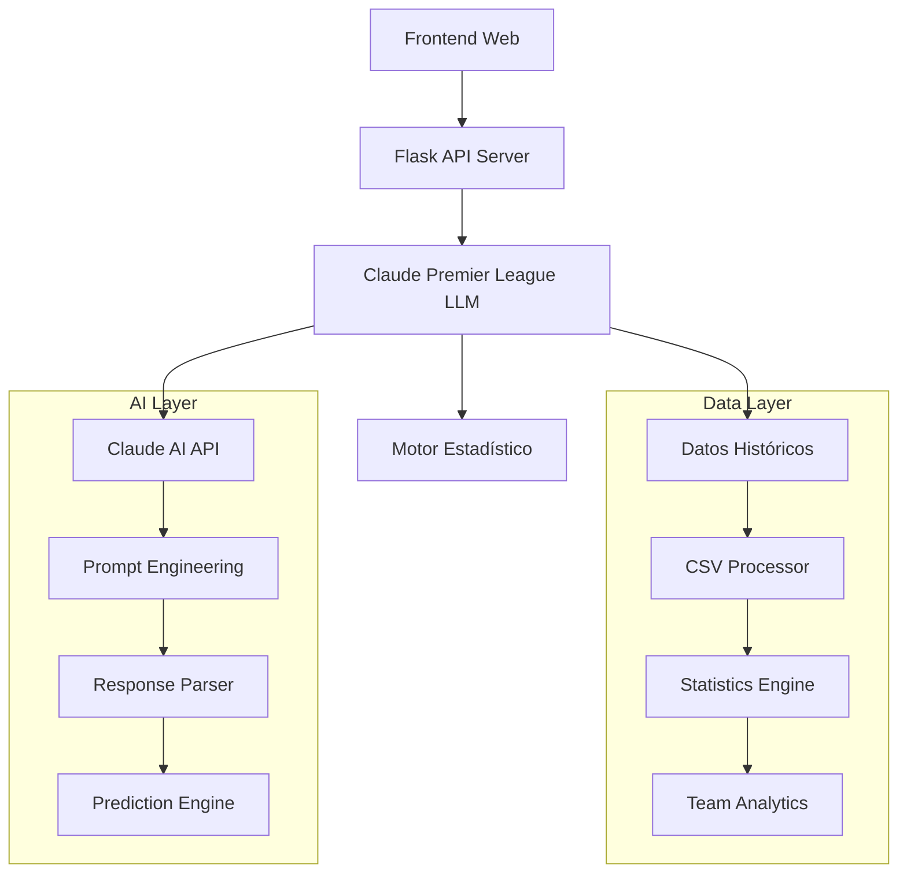

# 🏗️ Arquitectura del Sistema - LLM Premier League

## Visión General del Sistema

LLM Premier League es un sistema híbrido que combina análisis estadístico tradicional con inteligencia artificial avanzada (Claude AI) para proporcionar predicciones deportivas precisas.



---

## 🧩 Componentes Principales

### 1. **Frontend (JavaScript/HTML/CSS)**
**Ubicación**: `/front/`

- **Propósito**: Interfaz de usuario web responsiva
- **Tecnologías**: Vanilla JavaScript, CSS3, HTML5
- **Características**:
  - Predicción de partidos interactiva
  - Análisis de equipos
  - Chat con IA
  - Indicador visual de modo AI
  - Toggle de función AI

**Archivos clave:**
```
front/
├── app.js              # Lógica de la aplicación
├── styles.css          # Estilos y diseño
└── assets/             # Recursos multimedia
```

### 2. **API Server (Flask)**
**Ubicación**: `/LLM/api_server_optimized.py`

- **Propósito**: Servidor RESTful que expone funcionalidades del LLM
- **Tecnologías**: Flask, Flask-CORS
- **Puerto**: 8080 (configurable)

**Endpoints implementados:**
```python
GET  /api/health      # Estado del sistema
GET  /api/teams       # Lista de equipos
POST /api/predict     # Predicción de partidos  
POST /api/analyze     # Análisis de equipos
POST /api/chat        # Chat general con LLM
GET  /api/stats       # Estadísticas del sistema
```

### 3. **Motor de IA Principal**
**Ubicación**: `/LLM/premier_league_llm.py`

- **Clase**: `ClaudePremierLeagueLLM`
- **Propósito**: Core del sistema de predicciones
- **Capacidades**:
  - Predicciones con Claude AI
  - Análisis estadístico fallback
  - Feature toggle dinámico
  - Procesamiento de datos históricos

**Flujo de procesamiento:**
```python
1. Cargar datos históricos (CSV)
2. Calcular estadísticas por equipo
3. Si USE_CLAUDE_AI=true:
   └── Generar prompt contextualizado
   └── Llamar API de Claude
   └── Parsear respuesta JSON
4. Si falla o USE_CLAUDE_AI=false:
   └── Usar motor estadístico local
5. Retornar predicción estructurada
```

---

## 🔄 Feature Toggle System

### Concepto
El sistema implementa un toggle que permite alternar entre dos modos:

```python
# En .env
USE_CLAUDE_AI=true   # Claude AI + Datos locales
USE_CLAUDE_AI=false  # Solo datos locales
```

### Implementación
```python
class ClaudePremierLeagueLLM:
    def __init__(self, api_key=None):
        # Detectar modo desde variable de entorno
        self.use_claude_ai = os.getenv('USE_CLAUDE_AI', 'true').lower() == 'true'
        
        if self.use_claude_ai:
            # Configurar Claude AI
            self.api_key = api_key or os.getenv('CLAUDE_API_KEY')
            self.model = "claude-opus-4-20250514"  # Modelo más avanzado
        else:
            # Modo solo datos locales
            logger.info("📊 Modo solo datos locales activado")
```

### Ventajas del Toggle
- **Desarrollo**: Probar sin consumir API credits
- **Producción**: Failover automático si Claude no está disponible
- **Costos**: Control granular del uso de API externa
- **Performance**: Respuestas más rápidas en modo local

---

## 📊 Capa de Datos

### Fuentes de Datos
```
datasets/
└── processed/
    └── dataset_2014-2024_clean.csv  # 3,460 partidos históricos
```

### Estructura de Datos
```python
Columnas principales:
- HomeTeam, AwayTeam: Equipos
- FTHG, FTAG: Goles (Full Time Home/Away Goals)  
- FTR: Resultado (H/A/D - Home/Away/Draw)
- Date: Fecha del partido (si disponible)
```

### Procesamiento Estadístico
```python
def _calculate_advanced_statistics(self):
    """
    Calcula métricas por equipo:
    - goals_per_game: Promedio de goles por partido
    - goals_conceded_per_game: Goles recibidos promedio
    - win_rate: Porcentaje de victorias
    - home_win_rate: Victorias en casa
    - away_win_rate: Victorias fuera
    - recent_form: Forma reciente (W/D/L)
    """
```

---

## 🤖 Integración Claude AI

### Modelo Utilizado
- **Modelo**: `claude-opus-4-20250514`
- **Proveedor**: Anthropic
- **Capacidades**: Análisis contextual, razonamiento deportivo, predicciones probabilísticas

### Prompt Engineering
```python
def _create_prediction_prompt(self, home_team, away_team, stats...):
    """
    Prompt contextualizado que incluye:
    - Contexto temporal actualizado (2024-25)
    - Estadísticas históricas de ambos equipos
    - Enfrentamientos directos
    - Cambios recientes (entrenadores, fichajes)
    - Instrucciones de formato JSON
    """
```

### Response Parsing
```python
def _parse_claude_prediction(self, claude_response):
    """
    Extrae y valida JSON de la respuesta de Claude:
    - predicted_home_goals, predicted_away_goals
    - win_probability_home/draw/away
    - confidence_score, key_insights
    - expected_result, reasoning
    """
```

---

## 🔀 Flujo de Predicción

### Flujo Completo
```
1. Usuario solicita: "Liverpool vs Chelsea"
   ↓
2. API recibe POST /api/predict
   ↓
3. LLM valida equipos en datos históricos
   ↓
4. Calcula estadísticas de ambos equipos
   ↓
5. Si USE_CLAUDE_AI=true:
   ├── Genera prompt contextualizado
   ├── Llama a Claude API
   ├── Parsea respuesta JSON
   └── Retorna MatchPrediction
   
   Si falla o USE_CLAUDE_AI=false:
   └── Usa predicción estadística local
   ↓
6. API serializa respuesta a JSON
   ↓
7. Frontend muestra predicción visual
```

### Estructuras de Datos
```python
@dataclass
class MatchPrediction:
    home_team: str
    away_team: str
    predicted_home_goals: float
    predicted_away_goals: float
    win_probability_home: float
    win_probability_draw: float
    win_probability_away: float
    confidence_score: float
    key_insights: List[str]
    reasoning: str
    expected_result: str
```

---

## 🚦 Manejo de Errores

### Estrategias de Resilencia
```python
1. API Key Validation: Verifica Claude API key al inicio
2. Graceful Degradation: Si Claude falla → usar estadísticas locales
3. Data Validation: Valida equipos contra datos históricos
4. Response Parsing: Manejo robusto de JSON malformado
5. Timeout Handling: 30s timeout en llamadas a Claude
```

### Logging
```python
import logging
logger = logging.getLogger(__name__)

# Ejemplos:
logger.info("🤖 Modo Claude AI activado")
logger.warning("⚠️ API key de Claude no encontrada")
logger.error("❌ Error parseando respuesta de Claude")
```

---

## 🔧 Configuración y Variables

### Variables de Entorno (.env)
```env
# API Configuration
CLAUDE_API_KEY=sk-ant-api03-...  # Claude AI API key

# Feature Toggle
USE_CLAUDE_AI=true               # true/false

# Server Configuration (opcional)
FLASK_ENV=development           # development/production
PORT=8080                       # Puerto del servidor
```

### Configuración Hardcoded
```python
# En premier_league_llm.py
self.model = "claude-opus-4-20250514"  # Modelo Claude más avanzado
self.base_url = "https://api.anthropic.com/v1/messages"
timeout = 30  # Timeout de API calls
```

---

## 📈 Performance y Escalabilidad

### Métricas Actuales
- **Datos procesados**: 3,460 partidos históricos
- **Equipos soportados**: 34 equipos de Premier League
- **Tiempo de respuesta**: 
  - Modo local: ~100-300ms
  - Con Claude AI: ~2-5s (depende de la API)

### Optimizaciones Implementadas
```python
1. Carga única de datos: Los CSV se procesan solo al inicio
2. Caching de estadísticas: Team stats calculadas una vez
3. Fallback automático: No bloquea si Claude falla
4. Respuestas estructuradas: JSON optimizado para frontend
```

### Posibles Mejoras Futuras
- **Redis**: Cache distribuido para estadísticas
- **Database**: PostgreSQL para datos más complejos  
- **Load Balancing**: Múltiples instancias del servidor
- **CDN**: Cache estático para el frontend

---

## 🔒 Seguridad

### Medidas Implementadas
```python
1. API Key Protection: Variables de entorno, no hardcoded
2. CORS Configuration: Configurado en Flask-CORS
3. Input Validation: Validación de nombres de equipos
4. Error Sanitization: No exponer details internos en API
```

### Consideraciones para Producción
- HTTPS obligatorio
- Rate limiting en endpoints
- Authentication para API access
- Logging de accesos y errores
- Backup de datos históricos

---

## 🧪 Testing y Desarrollo

### Estructura para Testing
```
tests/ (por crear)
├── test_llm.py           # Tests del motor principal
├── test_api.py           # Tests de endpoints
├── test_predictions.py   # Validación de predicciones
└── test_data_processing.py # Tests de procesamiento
```

### Herramientas Sugeridas
- **pytest**: Framework de testing
- **coverage**: Cobertura de código
- **black**: Formateo de código
- **flake8**: Linting

---

## 📋 Conclusiones Arquitectónicas

### Fortalezas del Diseño
✅ **Modular**: Componentes bien separados  
✅ **Resiliente**: Fallback automático a datos locales  
✅ **Flexible**: Feature toggle permite múltiples modos  
✅ **Escalable**: Estructura preparada para crecimiento  
✅ **Mantenible**: Código limpio y bien documentado  

### Áreas de Mejora Identificadas
🔄 **Database**: Migrar de CSV a BD relacional  
🔄 **Caching**: Implementar cache distribuido  
🔄 **Testing**: Suite completa de tests automáticos  
🔄 **Monitoring**: Métricas y alertas de producción  
🔄 **Documentation**: Swagger/OpenAPI automático  

---

*Última actualización: Agosto 2025 - Versión 1.0*